# World of Warcraft Guild Management Application

A modern, responsive web application for managing and displaying World of Warcraft guild information, raid progression, and player statistics. Built with Next.js 14, React 18, and Material-UI.

## Version 2.1 Changelog 🆕

### Season Signup System Improvements
- **Renamed Routes**: Updated all routes from `/season3` to `/seasons` for better generic naming
- **Dynamic Season Management**: 
  - Season title now configurable in admin settings (`SEASON_TITLE`)
  - All season-related text is editable from admin panel
  - Season alert popup is fully configurable (toggle, title, message)
- **Test/Demo Character Filtering**: Added validation to prevent test/demo characters from being submitted
  - Form validation before submission
  - API route validation
  - Backend validation (three-layer protection)
- **Component Renaming**: 
  - `Season3Stats` → `SeasonsStats`
  - `Season3SignUp` → `SeasonsSignUp`
  - `Season3GoalsSection` → `SeasonsGoalsSection`
  - `Season3RosterTable` → `SeasonsRosterTable`
- **Field Name Updates**: Support for both old (`season3CharacterName`, `season3Goal`) and new (`seasonCharacterName`, `seasonGoal`) field names
- **Data Flow Improvements**: 
  - Removed caching to ensure live data display
  - Auto-refresh after successful signup
  - Improved data retrieval from backend

### New Settings Options
- **Season Page Settings**:
  - `SEASON_PAGE_TITLE` - Main title on seasons page
  - `SEASON_PAGE_DESCRIPTION` - Description text (with show/hide toggle)
  - `SEASON_PAGE_DESCRIPTION_ENABLED` - Toggle to show/hide description
  - `SEASON_SIGNUP_BUTTON_TEXT` - Text on signup button
  - `SEASON_SIGNUP_SUCCESS_MESSAGE` - Success message after signup
  - `SEASON_ROSTER_TABLE_TITLE` - Roster table title
  - `SEASON_ROSTER_TABLE_DESCRIPTION` - Roster table description
- **Season Alert Settings** (existing, enhanced):
  - `SEASON_ALERT_ENABLED` - Toggle to show/hide alert
  - `SEASON_ALERT_TITLE` - Alert popup title
  - `SEASON_ALERT_MESSAGE` - Alert popup message

### New Pages & Routes
- **`/seasons`** - Season signup page (renamed from `/season3`)
- **`/settings/season-signups`** - Admin panel for managing season signups
  - View all signups in a table
  - Search functionality
  - Delete signups
  - Displays both old and new field names

### API Routes
- **GET `/api/seasons/data`** - Fetch season signups (renamed from `/api/season3/data`)
- **POST `/api/seasons/signup`** - Submit season signup (renamed from `/api/season3/signup`)
- **GET `/api/season-signups`** - Get all signups for admin (existing)
- **DELETE `/api/season-signups/:id`** - Delete a signup (existing)

## Version 2.0 Changelog

### Major Features
- **Dynamic Recruitment/Join Page System**: Fully customizable guild recruitment page with block-based content management
- **Admin Settings Management**: New protected `/settings` route for comprehensive app configuration
- **Admin Authentication System**: Secure authentication required for install and settings pages
- **Database Reset Functionality**: Ability to reset database collections while preserving critical settings
- **Enhanced Security**: Protected routes with admin-only access for sensitive operations

### New Pages & Routes
- **`/join`** - Public guild recruitment page
  - Dynamic hero section with customizable title, subtitle, and badges
  - Flexible section-based layout with block components
  - Responsive design with modern glassmorphism effects
  - Real-time content updates from database
- **`/settings`** - Admin settings management page (protected)
  - View and edit app configuration
  - Protected fields (Guild Name, Realm, API Key) - view only or hidden
  - Editable fields for all other settings
  - Database reset functionality
- **`/settings/join`** - Join page content editor (protected)
  - Edit hero section (title, subtitle, badges)
  - Manage content sections with drag-and-drop ordering
  - Add/edit/remove content blocks (text, list, contact)
  - Real-time preview of changes
  - Seed database with example content
- **`/settings/errors`** - Error management (moved from `/errors`, now protected)
  - All error management features now require admin authentication
  - Same functionality as before, but secured behind admin login

### Installation & Setup Improvements
- **Guided Installation Process**: Step-by-step installation wizard at `/install`
  - App Settings configuration with Battle.net API validation
  - Automatic guild data fetching with real-time progress
  - Admin account creation with password strength requirements
- **Protected Install Page**: Once admin account exists, install page requires authentication
- **Settings Management**: Post-installation configuration changes through protected settings page

### New API Routes
- **GET `/api/jointext`** - Get join page content (public)
- **PUT `/api/jointext`** - Update join page content (admin only)
- **POST `/api/jointext/seed`** - Seed database with example join content (admin only)
- **POST `/api/install/login`** - Admin authentication for protected routes
- **GET `/api/settings`** - Get app settings (admin only, includes sensitive data)
- **PUT `/api/settings`** - Update app settings (admin only, protected fields excluded)
- **POST `/api/reset`** - Reset database collections (admin only)
- **GET `/api/reset/info`** - Get information about what will be reset

### Security Enhancements
- **Session-based Authentication**: Secure admin authentication using sessionStorage
- **Protected Routes**: All settings and error management routes require admin login
- **Field Protection**: Critical settings (Guild Name, Realm, API Key) cannot be changed after initial setup
- **Audit Logging**: Admin actions logged for security monitoring

### Configuration Management
- **Centralized Settings**: All app configuration managed through database
- **Protected Fields**: Guild name, realm, and API credentials protected from modification
- **Flexible Updates**: Most settings can be updated without full reinstallation
- **Settings Validation**: Real-time validation of Battle.net API credentials

### Dynamic Recruitment System
- **Hero Section Customization**: Edit title, subtitle, and colored badges from admin panel
- **Section-Based Layout**: Organize content into logical sections with flexible block positioning
- **Block Types**: 
  - **Text Blocks**: Rich text content with title
  - **List Blocks**: Bullet-pointed lists for requirements, benefits, schedules
  - **Contact Blocks**: Discord and email contact information with clickable links
- **Layout Options**: Each block can be positioned as full-width, left-half, or right-half
- **Visual Design**:
  - Modern glassmorphism effects with backdrop blur
  - Card-based layout with colored left borders (requirements=red, benefits=green, etc.)
  - Icon badges for each card type
  - Hover animations and glow effects
  - Responsive design for mobile, tablet, and desktop
- **Content Management**:
  - Add/remove/reorder sections and blocks
  - Real-time preview in admin panel
  - Database seeding with example content
  - No-cache fetching ensures fresh content
- **Database Structure**: All content stored in MongoDB `jointext` collection with section/block hierarchy

## Version 1.5.0 Changelog

### New Features
- **Comprehensive Seasonal Statistics System**: Complete Mythic+ seasonal data processing and analysis
- **Individual Character Profiles**: New detailed character pages with seasonal statistics and performance tracking
- **Enhanced Mythic+ Overview**: Redesigned with tabbed interface including Weekly Recap, Leaderboard, and Statistics
- **Seasonal Leaderboards**: Player, dungeon, and role-based rankings with real-time data
- **Character Detail Pages**: Individual character profiles with seasonal performance, team play history, and dungeon statistics
- **Advanced Data Visualization**: Enhanced charts and statistics for better guild insights

### New Pages & Components
- **Individual Character Pages**: `/member/[realm]/[character]` - Detailed character profiles with seasonal statistics
- **Enhanced Mythic+ Page**: Redesigned with three tabs (Weekly Recap, Leaderboard, Statistics)
- **SeasonalStatistics Component**: Comprehensive seasonal data visualization
- **SeasonalLeaderboard Component**: Interactive leaderboards with filtering and sorting
- **MemberDetail Screen**: Complete character profile with gear, stats, and seasonal performance

### New API Routes
- **GET `/api/seasonal-stats`** - Fetch latest seasonal statistics
- **GET `/api/seasonal-stats/character/[realm]/[character]`** - Get character seasonal statistics
- **GET `/api/seasonal-stats/leaderboard`** - Get seasonal leaderboards (players, dungeons, roles)

### Enhanced Data Features
- **Seasonal Performance Tracking**: Detailed analysis of Mythic+ runs, completion rates, and team compositions
- **Character Activity Detection**: Smart detection of character activity since season start
- **Team Play Analysis**: Track which players run together most frequently
- **Dungeon Performance**: Individual dungeon statistics with highest keys and completion rates
- **Role-Based Statistics**: Tank, healer, and DPS performance analysis


## 📄 License

This project is licensed under the **Creative Commons Attribution-NonCommercial-NoDerivatives 4.0 International License (CC BY-NC-ND 4.0)**.

**What this means:**
- ✅ You can share and redistribute the material in any medium or format
- ✅ You must give appropriate credit to the original author
- ❌ You may not use the material for commercial purposes
- ❌ You may not distribute modified versions of the material

For full license details, visit: https://creativecommons.org/licenses/by-nc-nd/4.0/

## 🖼️ Screenshots

### Version 2.0 Screenshots 🆕

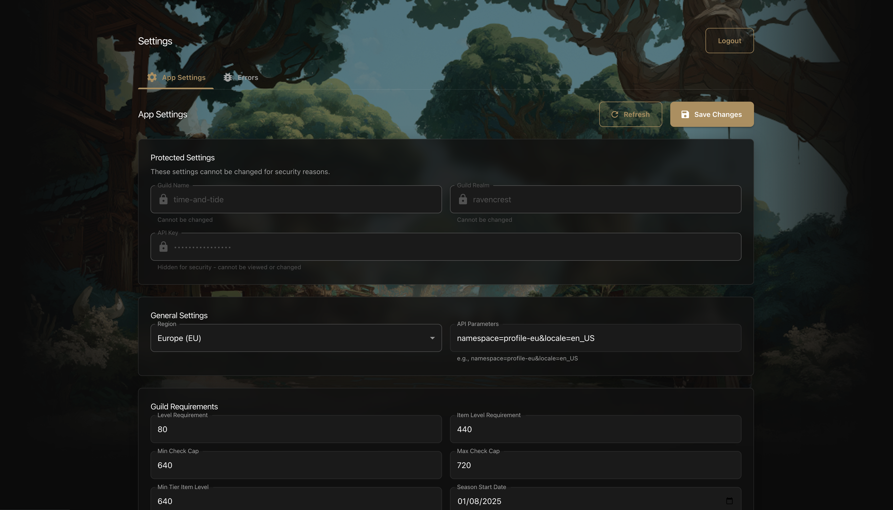
The new Admin Settings page allows comprehensive configuration management with protected fields and database reset functionality.

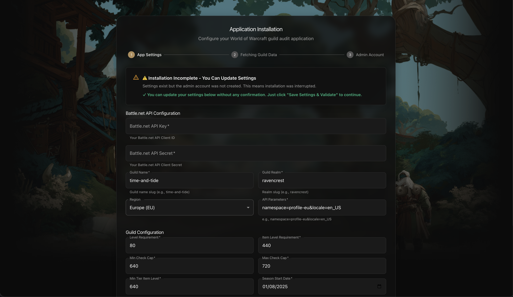
The guided installation process walks you through app configuration, guild data fetching, and admin account creation.

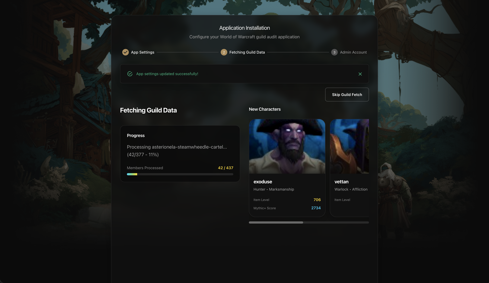
Real-time progress updates during guild data fetching with character cards and detailed statistics.

### Previous Versions

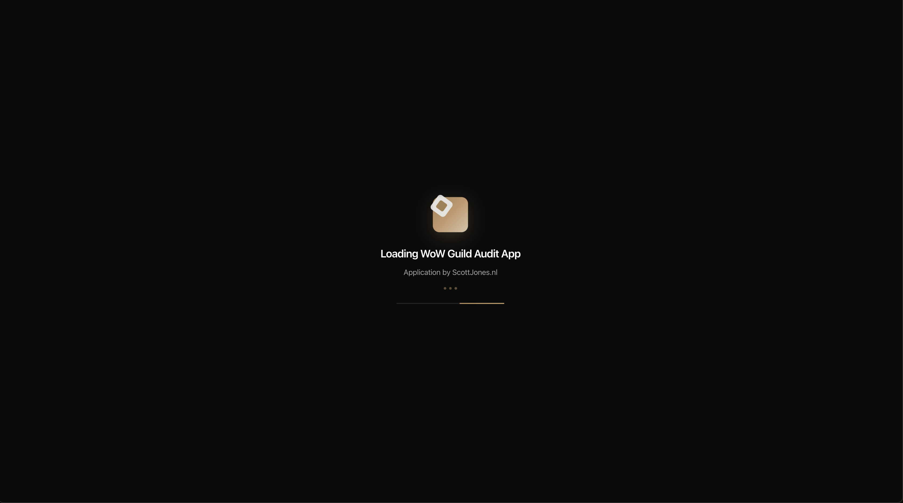

### Dashboard

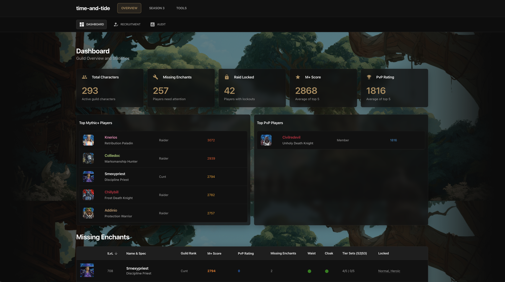

The Dashboard provides a comprehensive overview of your guild, including member statistics, top PvE and PvP performers, role distribution charts, missing enchants, and recent activity. It serves as the main landing page for quick insights into guild health and progression.

### Roster Builder

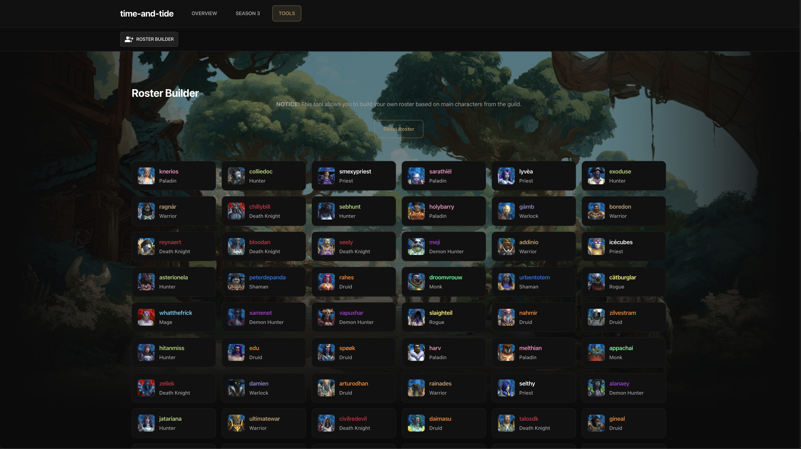

The Roster Builder is an interactive tool for planning raid compositions. Drag and drop characters into raid slots, filter by role or class, and optimize your team for upcoming encounters. This tool helps raid leaders organize and balance their groups efficiently.

### Audit

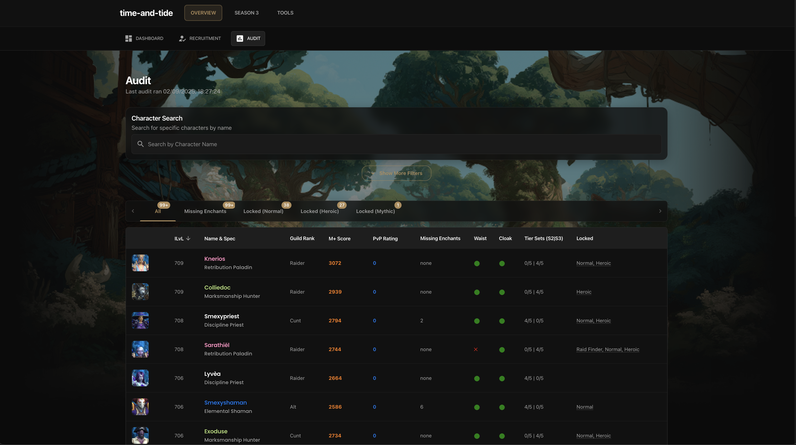

The Audit page offers detailed analysis of each guild member's character, including gear, missing enchants, item level, and raid lockout status. Use this section to identify areas for improvement and ensure your team is raid-ready.

### Mythic+ Overview

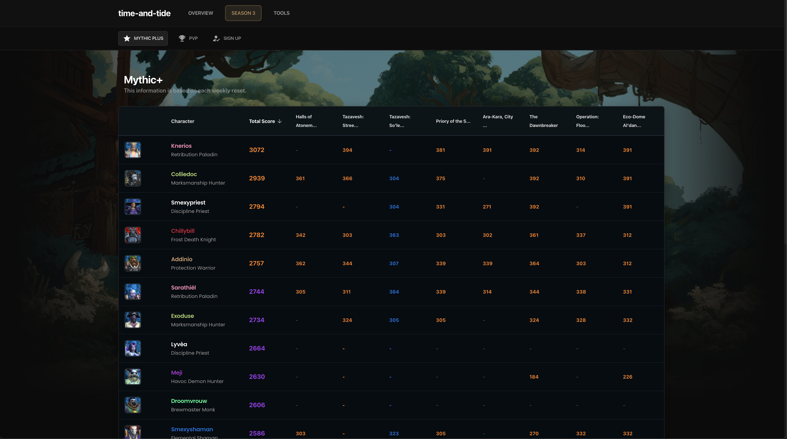

The Mythic+ Overview has been completely redesigned with a tabbed interface featuring three main sections:

#### Weekly Recap Tab
Displays current guild M+ activity, player scores, and recent achievements. Shows top performers and tracks overall Mythic+ activity.

#### Leaderboard Tab
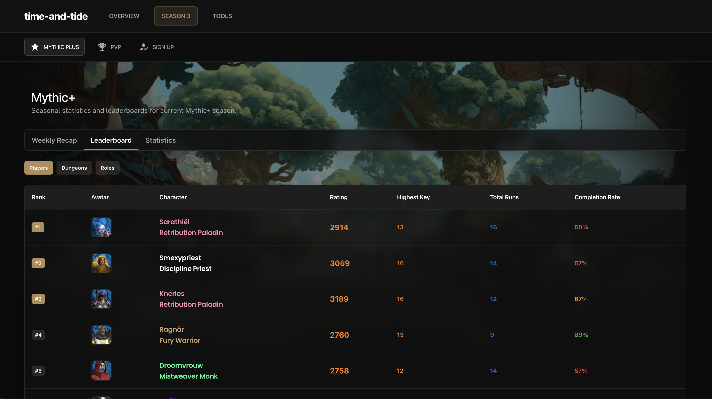

Interactive leaderboards with multiple ranking types:
- **Player Rankings**: Based on completion rate, total score, and highest key
- **Dungeon Rankings**: Performance across different dungeons
- **Role Rankings**: Tank, healer, and DPS performance comparisons

#### Statistics Tab
Comprehensive seasonal statistics including:
- Guild participation rates
- Total runs and completion statistics
- Key achievements and milestones
- Role distribution and performance metrics

### Individual Character Profiles

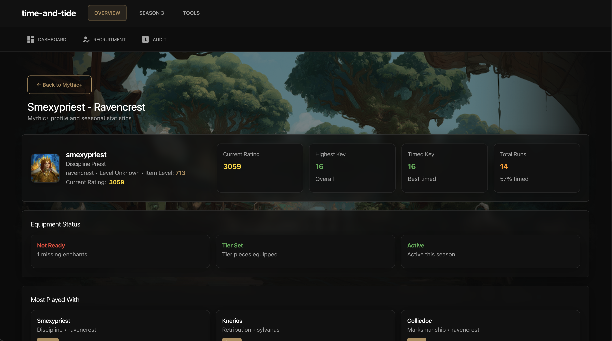

New detailed character profile pages (`/member/[realm]/[character]`) featuring:

#### Character Overview
- Character avatar and basic information
- Current Mythic+ rating and item level
- Class, spec, and realm information
- Equipment status and readiness indicators

#### Seasonal Performance
- Detailed seasonal statistics
- Highest timed and overall keys
- Total runs and completion rates
- Team play history and most-played-with members

#### Dungeon Performance
- Individual dungeon statistics
- Highest keys per dungeon
- Completion rates and average ratings
- Performance trends and improvements

#### Equipment Analysis
- Gear status and enchantment tracking
- Tier set detection
- Raid readiness indicators
- Missing enchantments and improvements

### Season 3 Signup

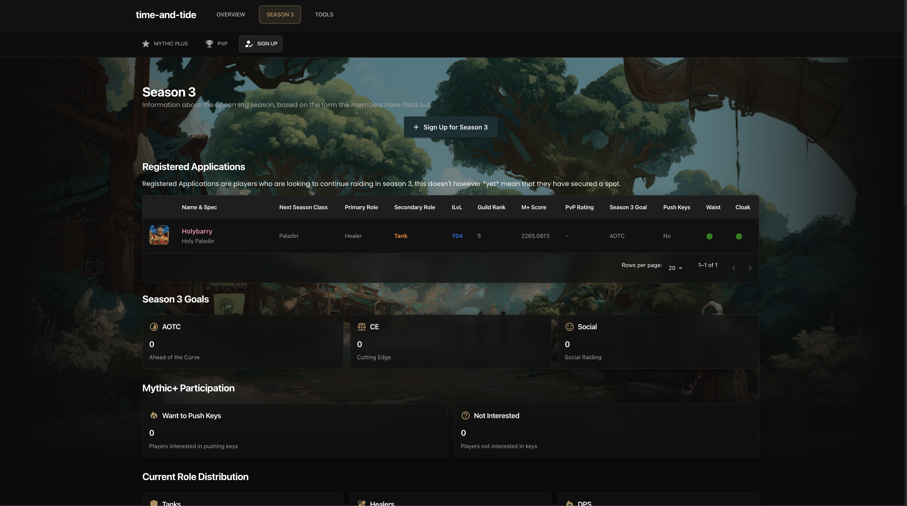

The Season 3 Signup page allows members to register their interest and goals for the upcoming season. Collect information on returning players, preferred roles, and personal objectives to streamline roster planning.

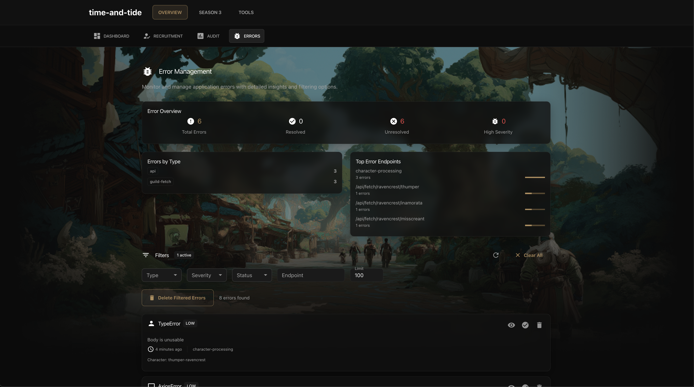

The errors screen allows you to gather insight on what is happening in the application, for example if you hit rate limits, characters are not found or the service goes down.

### UI/Design Example

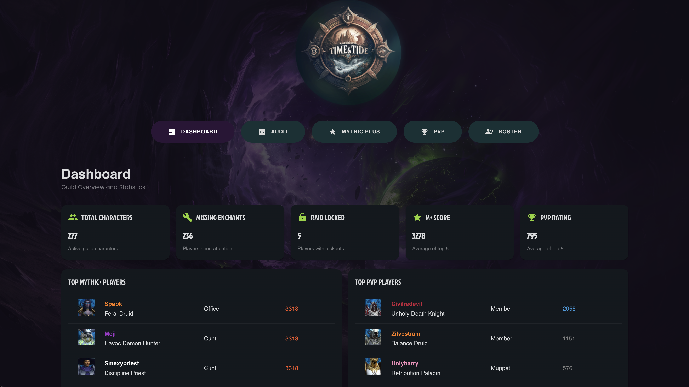

## 🔧 Environment Variables

Create a `.env.local` file in the root directory with the following variables:

```bash
# Backend API Configuration
NEXT_PUBLIC_BACKEND_URL=http://localhost:8000
NEXT_PUBLIC_CLIENT_BACKEND_URL=http://localhost:8000

# Guild Information
NEXT_PUBLIC_GUILD_NAME=Your Guild Name
NEXT_PUBLIC_GUILD_REALM=Your Realm Name

# Application URLs
NEXT_PUBLIC_BASE_URL=https://your-domain.com
NEXT_PUBLIC_APP_URL=https://your-domain.com
```

### Environment Variables Explained

| Variable | Description | Required |
|----------|-------------|----------|
| `NEXT_PUBLIC_BACKEND_URL` | URL of your backend API server | ✅ |
| `NEXT_PUBLIC_CLIENT_BACKEND_URL` | Client-side backend URL (fallback) | ✅ |
| `NEXT_PUBLIC_GUILD_NAME` | Your guild's name for display | ✅ |
| `NEXT_PUBLIC_GUILD_REALM` | Your guild's realm name | ✅ |
| `NEXT_PUBLIC_BASE_URL` | Your application's base URL for SEO | ✅ |
| `NEXT_PUBLIC_APP_URL` | Your application's URL for API calls | ✅ |

## ⚙️ Application Configuration

### Installation-Based Configuration (v2.0+)

Starting with version 2.0, application configuration is primarily managed through the database via the installation wizard. The `app.config.js` file serves as a fallback and default values source.

**Configuration Flow:**
1. **Initial Setup**: Use `/install` page to configure all settings
2. **Database Storage**: Settings are saved to MongoDB `AppSettings` collection
3. **Runtime Loading**: Application loads settings from database at runtime
4. **Fallback**: If database settings don't exist, falls back to `app.config.js` defaults

**Updating Configuration:**
- **Most Settings**: Update via `/settings` page (admin login required)
- **Protected Settings**: Guild Name, Realm, API Key can only be changed via `/install` page
- **Database Reset**: Use `/settings` → Reset Database to start fresh

### Legacy Configuration (app.config.js)

The `app.config.js` file still exists for reference and fallback purposes:

### Guild Settings
```javascript
{
  "GUILD_NAME": "Your Guild Name",
  "GUILD_REALM": "Your Realm",
  "REGION": "eu",
  "LEVEL_REQUIREMENT": 80,
  "ITEM_LEVEL_REQUIREMENT": 450,
  "MIN_CHECK_CAP": 450,
  "MAX_CHECK_CAP": 720,
  "MIN_TIER_ITEMLEVEL": 640
}
```

### Role Definitions
```javascript
{
  "TANKS": ["Blood", "Vengeance", "Guardian", "Brewmaster", "Protection"],
  "HEALERS": ["Preservation", "Mistweaver", "Holy", "Discipline", "Restoration"],
  "MAIN_RANKS": [0,1,2,3,4,5,6,7],
  "ALT_RANKS": [8,9,10]
}
```

### Guild Ranks
```javascript
{
  "GUILLD_RANKS": [
    "Guild Lead",
    "Officer", 
    "Officer Alt",
    "Raider",
    "Trial Raider",
    "Member",
    "Alt",
    "New Recruit"
  ]
}
```

### Navigation Configuration
```javascript
{
  "NAVIGATION": {
    "OVERVIEW": {
      "label": "OVERVIEW",
      "items": [
        {
          "label": "DASHBOARD",
          "path": "/",
          "icon": "DashboardIcon"
        },
        {
          "label": "RECRUITMENT",
          "path": "/join",
          "icon": "HowToRegIcon"
        },
        {
          "label": "AUDIT",
          "path": "/audit",
          "icon": "AssessmentIcon"
        },
        {
          "label": "ERRORS",
          "path": "/errors",
          "icon": "BugReportIcon"
        }
      ]
    },
    "SEASON3": {
      "label": "SEASON 3",
      "items": [
        {
          "label": "MYTHIC PLUS",
          "path": "/mythic-plus",
          "icon": "StarIcon"
        },
        {
          "label": "PVP",
          "path": "/rated-pvp",
          "icon": "EmojiEventsIcon"
        },
        {
          "label": "SIGN UP",
          "path": "/season3",
          "icon": "HowToRegIcon"
        }
      ]
    },
    "TOOLS": {
      "label": "TOOLS",
      "items": [
        {
          "label": "ROSTER BUILDER",
          "path": "/roster",
          "icon": "GroupAddIcon"
        }
      ]
    }
  }
}
```

#### Available Icons
The following Material-UI icons are available for navigation items:
- `DashboardIcon` - Dashboard/home icon
- `AssessmentIcon` - Assessment/audit icon
- `StarIcon` - Star icon for Mythic+ features
- `EmojiEventsIcon` - Trophy icon for PvP features
- `GroupAddIcon` - Group/add icon for roster tools
- `HowToRegIcon` - Registration/signup icon
- `BugReportIcon` - Bug report icon for error management
- `PrecisionManufacturingIcon` - Tools/manufacturing icon

## 🚀 Key Features

### Real-time Data Updates
- 10-minute cache revalidation
- Server-side data fetching
- Optimistic UI updates

### Responsive Design
- Mobile-first approach
- Material-UI components
- Custom SCSS styling

### Performance Optimizations
- Next.js App Router
- Server-side rendering
- Image optimization
- Code splitting

### Accessibility
- ARIA labels
- Keyboard navigation
- Screen reader support
- High contrast mode

### Theme & Screen System
- Flexible theme system with direct imports for optimal performance
- Easy customization without lazy loading overhead
- Theme-aware component selection
- Consistent patterns across themes


## 🏗️ Architecture Overview

This is a Next.js 14 frontend application that serves as a comprehensive guild management dashboard. It connects to a separate backend API to fetch guild data, player statistics, and raid progression information.

### Backend API

The backend API server for this application can be found at: [https://github.com/thedanzor/world-of-warcraft-api](https://github.com/thedanzor/world-of-warcraft-api)

The backend is an Express.js API server that:
- Fetches guild data from the Battle.net API
- Processes character information, gear, and statistics
- Provides real-time data updates via WebSocket
- Manages MongoDB data storage
- Handles authentication and rate limiting
- Supports both Retail and Classic WoW guilds

### Tech Stack
- **Framework**: Next.js 14 (App Router)
- **UI Library**: Material-UI (MUI) v5
- **Styling**: SCSS + Tailwind CSS
- **State Management**: React Hooks
- **Charts**: Recharts
- **Drag & Drop**: React DnD
- **Fonts**: Google Fonts (Poppins, Public Sans)

## 🗂️ Routes & Features

### Main Pages

#### `/` - Dashboard
- **Purpose**: Main guild overview and statistics
- **Features**: 
  - Guild member overview
  - Top players (PvE/PvP)
  - Role distribution charts
  - Missing enchants statistics
  - Recent activity feed
- **Data**: Fetches comprehensive guild data with statistics

#### `/roster` - Roster Builder
- **Purpose**: Interactive raid roster planning
- **Features**:
  - Drag & drop character assignment
  - Role-based filtering
  - Raid composition optimization
  - Save/load roster configurations
- **Data**: Full guild member list with roles and specs

#### `/audit` - Guild Audit
- **Purpose**: Detailed guild member analysis
- **Features**:
  - Character gear analysis
  - Missing enchants tracking
  - Item level requirements
  - Raid lockout status
  - Performance metrics
- **Data**: Detailed character data with gear analysis

#### `/mythic-plus` - Mythic+ Overview
- **Purpose**: Comprehensive Mythic+ dungeon progression tracking with seasonal statistics
- **Features**:
  - **Weekly Recap Tab**: Current guild M+ activity and player scores
  - **Leaderboard Tab**: Interactive rankings for players, dungeons, and roles
  - **Statistics Tab**: Comprehensive seasonal statistics and achievements
  - Player M+ scores and progression tracking
  - Seasonal performance analysis
- **Data**: M+ specific data with seasonal statistics and leaderboards

#### `/rated-pvp` - PvP Overview
- **Purpose**: Rated PvP player tracking
- **Features**:
  - Arena ratings
  - RBG ratings
  - Top PvP performers
  - Season progression
- **Data**: PvP specific data filtered from guild roster

#### `/season3` - Season 3 Planning
- **Purpose**: Season 3 preparation and signup
- **Features**:
  - Season 3 signup forms
  - Character planning tools
  - Goal setting
  - Returning player tracking
- **Data**: Season 3 specific data and signups

#### `/mrt` - MRT Integration
- **Purpose**: Method Raid Tools integration
- **Features**:
  - MRT note import/export
  - Raid composition tools
  - Character note management
- **Data**: MRT compatible data structures

#### `/member/[realm]/[character]` - Individual Character Profiles 🆕 **NEW v1.5.0**
- **Purpose**: Detailed character profiles with seasonal statistics and performance tracking
- **Features**:
  - **Character Overview**: Avatar, basic info, current rating, and equipment status
  - **Seasonal Performance**: Detailed M+ statistics, highest keys, and completion rates
  - **Team Play Analysis**: Most-played-with members and team composition history
  - **Dungeon Performance**: Individual dungeon statistics and performance trends
  - **Equipment Analysis**: Gear status, enchantments, tier sets, and raid readiness
  - **Activity Tracking**: Season activity detection and performance metrics
- **Data**: Complete character data with seasonal statistics and team play analysis

#### `/join` - Guild Recruitment 🆕 **ENHANCED in v2.0**
- **Purpose**: Dynamic, fully customizable guild recruitment page
- **Features**:
  - **Customizable Hero Section**: Editable title, subtitle, and colored badges (gold/blue/green)
  - **Section-Based Layout**: Organize content into logical sections
  - **Flexible Block System**: Three block types for different content needs
    - **Text Blocks**: Rich text content with titles
    - **List Blocks**: Bullet-pointed lists for requirements, benefits, schedules
    - **Contact Blocks**: Discord and email links with clickable buttons
  - **Layout Control**: Position each block as full-width, left-half, or right-half
  - **Modern Design**: Glassmorphism effects, hover animations, colored borders by type
  - **Responsive**: Fully responsive design for mobile, tablet, and desktop
  - **Icon Badges**: Automatic icon assignment based on content type (requirements, benefits, etc.)
- **Data**: Dynamic content from MongoDB `jointext` collection
- **Admin Panel**: Content fully editable via `/settings/join` (admin only)
- **Example Content**: Includes seeded example content on installation

#### `/settings` - Admin Settings Management 🆕 **NEW v2.0**
- **Purpose**: Comprehensive app configuration and management (admin only)
- **Features**:
  - View and edit app settings (most fields editable)
  - Protected fields: Guild Name, Realm, API Key (view only or hidden)
  - Database reset functionality
  - Real-time settings validation
  - Secure admin authentication required
- **Data**: App configuration from database
- **Access**: Requires admin login

#### `/settings/errors` - Error Management 🆕 **MOVED in v2.0**
- **Purpose**: Monitor and manage application errors (admin only)
- **Features**:
  - Error statistics dashboard
  - Advanced filtering (type, endpoint, severity, resolution status)
  - Error resolution tracking
  - Bulk error deletion
  - Detailed error views with stack traces
  - Real-time error monitoring
- **Data**: Error logs and statistics from backend API
- **Access**: Requires admin login (moved from `/errors`)

### API Routes

#### Data Endpoints
- `GET /api/data` - Filtered and paginated guild data
- `GET /api/health` - Backend health check
- `GET /api/status` - Backend status information

#### Statistics Endpoints
- `GET /api/stats/missing-enchants` - Missing enchants statistics
- `GET /api/stats/top-pvp` - Top PvP players
- `GET /api/stats/top-pve` - Top PvE players
- `GET /api/stats/role-counts` - Role distribution counts

#### Seasonal Statistics Endpoints 🆕 **NEW v1.5.0**
- `GET /api/seasonal-stats` - Fetch latest seasonal statistics
- `GET /api/seasonal-stats/character/[realm]/[character]` - Get character seasonal statistics
- `GET /api/seasonal-stats/leaderboard` - Get seasonal leaderboards (players, dungeons, roles)

#### Season 3 Endpoints
- `GET /api/season3/data` - Season 3 data
- `POST /api/season3/signup` - Season 3 signup
- `GET /api/season3/test` - Season 3 endpoint testing

#### Error Management Endpoints
- `GET /api/errors` - Fetch errors with filtering options
- `GET /api/errors/stats` - Get error statistics
- `GET /api/errors/[id]` - Get specific error details
- `PUT /api/errors/[id]/resolve` - Mark error as resolved
- `DELETE /api/errors/[id]` - Delete specific error
- `DELETE /api/errors` - Bulk delete errors (with filters)

#### Join/Recruitment Content Endpoints 🆕 **NEW v2.0**
- `GET /api/jointext` - Get join page content (public)
- `PUT /api/jointext` - Update join page content (admin only)
- `POST /api/jointext/seed` - Seed database with example join content (admin only)

#### Admin & Settings Endpoints 🆕 **NEW v2.0**
- `POST /api/install/login` - Admin authentication
- `GET /api/settings` - Get app settings (admin only)
- `PUT /api/settings` - Update app settings (admin only)
- `POST /api/reset` - Reset database collections (admin only)
- `GET /api/reset/info` - Get reset information

#### Installation Endpoints 🆕 **NEW v2.0**
- `GET /api/install` - Check installation status
- `POST /api/install` - Save app settings (with validation)
- `POST /api/install/admin` - Create admin account

#### Utility Endpoints
- `GET /api/test-connection` - Backend connectivity testing
- `POST /api/update` - Trigger data updates

## 🎨 Theme & Screen System

The application uses a flexible theme and screen system that allows for easy customization while maintaining clean separation of concerns. This system makes it simple to create multiple visual themes and track changes across different versions of the application.

### System Overview

The theme system consists of two main parts:
1. **Themes** - Visual styling and layout configurations
2. **Screens** - Page-specific components that adapt to the current theme

### Directory Structure

```
core/
├── themes/                    # Theme definitions
│   ├── default/              # Default theme (currently active)
│   │   ├── index.jsx         # Theme provider and configuration
│   │   ├── base.scss         # Base styling variables
│   │   └── config.js         # Theme configuration
│   └── _add_your_own_/       # Template for custom themes
├── screens/                   # Screen components
│   ├── default/              # Default screen implementations
│   │   ├── dashboard.jsx     # Dashboard screen
│   │   ├── audit.jsx         # Audit screen
│   │   ├── rosterBuilder.jsx # Roster builder screen
│   │   ├── recruitment.jsx   # Recruitment screen
│   │   ├── pvp.jsx           # PvP screen
│   │   ├── mythicPlus.jsx    # Mythic+ screen
│   │   ├── season3.jsx       # Season 3 screen
│   │   ├── error.jsx         # Error screen
│   │   └── not-found.jsx     # Not found screen
│   └── _add_your_own_/       # Template for custom screens
└── components/                # Shared components (theme-agnostic)
```

### Theme Configuration

Themes are configured in `app.config.js`:

```javascript
const data = {
    "THEME": "default",  // Current active theme
    // ... other configuration
}
```

### How It Works

#### 1. Direct Imports with Theme Selection

The system uses direct imports for optimal performance, with theme-aware component selection:

```jsx
import DynamicScreenLoader from '@/core/dynamicScreenLoader'
import DynamicThemeLoader from '@/core/dynamicThemeLoader'

// Usage with automatic theme selection
<DynamicThemeLoader>
    <DynamicScreenLoader 
        screenName="dashboard"
        props={{ guildData }}
    />
</DynamicThemeLoader>

// Usage with theme override
<DynamicThemeLoader theme="custom">
    <DynamicScreenLoader 
        screenName="dashboard"
        props={{ guildData }}
        theme="custom"
    />
</DynamicThemeLoader>
```

#### 2. Theme Provider System

Themes provide styling and configuration through a provider pattern:

```jsx
// core/themes/default/index.jsx
import { ThemeProvider as MuiThemeProvider } from '@mui/material/styles'
import { createTheme } from '@mui/material/styles'
import baseStyles from './base.scss'

const theme = createTheme({
    palette: {
        primary: { main: '#8dd52b' },
        secondary: { main: '#d38a2a' },
        // ... theme-specific colors
    },
    // ... other theme configuration
})

export default function ThemeProvider({ children }) {
    return (
        <MuiThemeProvider theme={theme}>
            {children}
        </MuiThemeProvider>
    )
}
```

#### 3. Screen Component Structure

Each screen component follows a consistent pattern:

```jsx
// core/screens/default/dashboard.jsx
import { Box, Grid } from '@mui/material'
import { MultiColorHeadingH1 } from '@/core/components/typography'
import '@/core/screens/default/scss/dashboard.scss'

const Dashboard = ({ guildData }) => {
    return (
        <section className="dashboard">
            <Box sx={{ p: 3 }}>
                <MultiColorHeadingH1>Dashboard</MultiColorHeadingH1>
                {/* Screen-specific content */}
            </Box>
        </section>
    )
}

export default Dashboard
```

### Creating Custom Themes

#### Step 1: Create Theme Directory

```bash
mkdir core/themes/my-custom-theme
```

#### Step 2: Create Theme Files

```jsx
// core/themes/my-custom-theme/index.jsx
import { ThemeProvider as MuiThemeProvider } from '@mui/material/styles'
import { createTheme } from '@mui/material/styles'
import './base.scss'

const theme = createTheme({
    palette: {
        primary: { main: '#ff6b6b' },    // Custom primary color
        secondary: { main: '#4ecdc4' },  // Custom secondary color
        background: { 
            default: '#2c3e50',
            paper: '#34495e'
        }
    },
    typography: {
        fontFamily: '"Roboto", "Helvetica", "Arial", sans-serif',
        h1: { fontSize: '2.5rem', fontWeight: 700 },
        h2: { fontSize: '2rem', fontWeight: 600 }
    }
})

export default function ThemeProvider({ children }) {
    return (
        <MuiThemeProvider theme={theme}>
            {children}
        </MuiThemeProvider>
    )
}
```

#### Step 3: Create Theme Styles

```scss
// core/themes/my-custom-theme/base.scss
:root {
    --primary-color: #ff6b6b;
    --secondary-color: #4ecdc4;
    --background-color: #2c3e50;
    --text-color: #ecf0f1;
    --accent-color: #f39c12;
}

// Theme-specific global styles
body {
    background-color: var(--background-color);
    color: var(--text-color);
}

// Custom component overrides
.MuiButton-primary {
    background-color: var(--primary-color);
    &:hover {
        background-color: darken(#ff6b6b, 10%);
    }
}
```

#### Step 4: Create Custom Screens (Optional)

If you want to completely customize a screen:

```jsx
// core/screens/my-custom-theme/dashboard.jsx
import { Box, Card, Typography } from '@mui/material'
import '@/core/screens/my-custom-theme/scss/dashboard.scss'

const Dashboard = ({ guildData }) => {
    return (
        <section className="custom-dashboard">
            <Box sx={{ p: 4 }}>
                <Typography variant="h1" sx={{ color: 'primary.main' }}>
                    My Custom Dashboard
                </Typography>
                {/* Completely custom layout and components */}
            </Box>
        </section>
    )
}

export default Dashboard
```

#### Step 5: Register Custom Theme

Add your custom theme to the dynamic screen loader:

```jsx
// core/dynamicScreenLoader.jsx
import CustomDashboard from './screens/my-custom-theme/dashboard';
import CustomRosterBuilder from './screens/my-custom-theme/rosterBuilder';
// ... import other custom screens

const screenComponents = {
  default: {
    // ... existing default screens
  },
  'my-custom-theme': {
    dashboard: CustomDashboard,
    rosterBuilder: CustomRosterBuilder,
    // ... other custom screens
  }
};
```

#### Step 6: Activate Custom Theme

Update `app.config.js`:

```javascript
const data = {
    "THEME": "my-custom-theme",  // Switch to custom theme
    // ... other configuration
}
```

### Creating Custom Screens

#### Step 1: Create Screen Directory

```bash
mkdir core/screens/my-custom-theme
mkdir core/screens/my-custom-theme/scss
```

#### Step 2: Create Screen Component

```jsx
// core/screens/my-custom-theme/customPage.jsx
import { Box, Typography } from '@mui/material'
import '@/core/screens/my-custom-theme/scss/customPage.scss'

const CustomPage = ({ data }) => {
    return (
        <section className="custom-page">
            <Box sx={{ p: 3 }}>
                <Typography variant="h1">Custom Page</Typography>
                {/* Custom content */}
            </Box>
        </section>
    )
}

export default CustomPage
```

#### Step 3: Create Screen Styles

```scss
// core/screens/my-custom-theme/scss/customPage.scss
.custom-page {
    background: linear-gradient(135deg, var(--primary-color), var(--secondary-color));
    min-height: 100vh;
    
    h1 {
        color: white;
        text-shadow: 2px 2px 4px rgba(0,0,0,0.5);
    }
}
```

#### Step 4: Register Screen with Theme

Add your custom screen to the dynamic screen loader:

```jsx
// core/dynamicScreenLoader.jsx
import CustomPage from './screens/my-custom-theme/customPage';

const screenComponents = {
  default: {
    // ... existing screens
  },
  'my-custom-theme': {
    // ... existing custom screens
    customPage: CustomPage,
  }
};
```

#### Step 5: Use Custom Screen

```jsx
// In any page file
import DynamicScreenLoader from '@/core/dynamicScreenLoader'

// Usage
<DynamicScreenLoader 
    screenName="customPage"
    props={{ data: pageData }}
    theme="my-custom-theme"
/>
```

### Benefits of This System

#### 🎯 **Easy Customization**
- Change entire visual themes by updating one configuration value
- Create custom screen implementations without affecting other themes
- Maintain consistent component structure across themes

#### 📊 **Change Tracking**
- Clear separation between theme-specific and shared code
- Easy to compare changes between different theme versions
- Git-friendly structure for tracking modifications

#### 🔧 **Maintainability**
- Shared components remain consistent across themes
- Theme-specific code is isolated and easy to manage
- Clear patterns for developers to follow

#### 🚀 **Performance**
- Direct imports ensure optimal build-time and runtime performance
- No lazy loading overhead or Suspense boundaries
- All components are available immediately
- Better tree-shaking and code optimization by Next.js

### Best Practices

#### 1. **Keep Shared Components Theme-Agnostic**
```jsx
// ✅ Good - Component adapts to theme
const Button = ({ children, variant = 'primary' }) => (
    <MuiButton variant={variant} className={`theme-button ${variant}`}>
        {children}
    </MuiButton>
)

// ❌ Avoid - Hard-coded theme-specific styling
const Button = ({ children }) => (
    <button style={{ backgroundColor: '#8dd52b' }}>
        {children}
    </button>
)
```

#### 2. **Use CSS Variables for Theme Values**
```scss
// ✅ Good - Theme-agnostic
.button {
    background-color: var(--primary-color);
    color: var(--text-color);
}

// ❌ Avoid - Hard-coded values
.button {
    background-color: #8dd52b;
    color: white;
}
```

#### 3. **Maintain Consistent File Structure**
```
core/
├── themes/
│   └── theme-name/
│       ├── index.jsx          # Theme provider
│       ├── base.scss          # Base styles
│       └── config.js          # Configuration
└── screens/
    └── theme-name/
        ├── screenName.jsx     # Screen component
        └── scss/
            └── screenName.scss # Screen styles
```

#### 4. **Document Theme Dependencies**
```jsx
// core/themes/my-theme/README.md
# My Custom Theme

## Dependencies
- Requires Material-UI v5
- Compatible with Next.js 14
- Uses custom color palette

## Customization Options
- Primary color: #ff6b6b
- Secondary color: #4ecdc4
- Background: Dark theme
- Typography: Roboto font family

## Usage
Set `THEME: "my-theme"` in app.config.js
```

### Migration Guide

If you're upgrading from the old lazy loading system:

#### Before (Old Lazy Loading System)
```jsx
import { lazy, Suspense } from 'react'
import config from '@/app.config.js'

// Theme provider
const ThemeProvider = lazy(() => import(`@/core/themes/${config.THEME}`))

// Screen component
const Dashboard = lazy(() => import(`@/core/screens/${config.THEME}/dashboard`))

// Wrap in Suspense
<Suspense fallback={<div>Loading...</div>}>
    <ThemeProvider>
        <Suspense fallback={<div>Loading Dashboard...</div>}>
            <Dashboard guildData={guildData} />
        </Suspense>
    </ThemeProvider>
</Suspense>
```

#### After (New Direct Import System)
```jsx
import DynamicScreenLoader from '@/core/dynamicScreenLoader'
import DynamicThemeLoader from '@/core/dynamicThemeLoader'

// Simple, direct usage
<DynamicThemeLoader>
    <DynamicScreenLoader 
        screenName="dashboard"
        props={{ guildData }}
    />
</DynamicThemeLoader>
```

### Troubleshooting

#### Common Issues

1. **Component Not Loading**
   - Check that the theme directory exists in `core/themes/`
   - Verify the screen component file exists in `core/screens/{theme}/`
   - Ensure the screen is properly registered in `dynamicScreenLoader.jsx`
   - Check browser console for error messages

2. **Styling Not Applied**
   - Check that theme SCSS files are imported in the screen component
   - Verify CSS variables are defined in the theme's `base.scss`
   - Ensure theme provider is wrapping the component tree in `layout.jsx`

3. **Build Errors**
   - Check for typos in import statements in `dynamicScreenLoader.jsx`
   - Verify all theme files exist and are properly exported
   - Ensure proper export statements in theme files

4. **Theme Not Switching**
   - Verify `THEME` is set correctly in `app.config.js`
   - Check that the theme is registered in `screenComponents` object
   - Ensure theme directory structure matches expected pattern

#### Debug Mode

Enable debug logging by adding to your theme:

```jsx
// core/themes/my-theme/index.jsx
console.log('Loading theme:', config.THEME)
console.log('Theme path:', `@/core/themes/${config.THEME}`)
```

You can also use the helper functions to debug available themes:

```jsx
import { getAvailableThemes, getAvailableScreens } from '@/core/dynamicScreenLoader'

console.log('Available themes:', getAvailableThemes())
console.log('Available screens for default theme:', getAvailableScreens('default'))
```

This theme and screen system provides a robust foundation for customization while maintaining clean code organization and easy change tracking. Whether you're creating a simple color scheme change or a complete visual overhaul, the system scales to meet your needs.

### Helper Functions

The dynamic screen loader and theme loader provide several helper functions for theme management:

#### Screen Loader Helpers

#### `registerTheme(themeName, screens)`
Register a new theme with its screen components:

```jsx
import { registerTheme } from '@/core/dynamicScreenLoader'
import CustomDashboard from './screens/my-theme/dashboard'
import CustomRoster from './screens/my-theme/rosterBuilder'

registerTheme('my-theme', {
  dashboard: CustomDashboard,
  rosterBuilder: CustomRoster,
  // ... other screens
})
```

#### `getAvailableThemes()`
Get a list of all available themes:

```jsx
import { getAvailableThemes } from '@/core/dynamicScreenLoader'

const themes = getAvailableThemes()
console.log('Available themes:', themes) // ['default', 'my-theme']
```

#### `getAvailableScreens(themeName)`
Get a list of available screens for a specific theme:

```jsx
import { getAvailableScreens } from '@/core/dynamicScreenLoader'

const screens = getAvailableScreens('default')
console.log('Default theme screens:', screens) // ['dashboard', 'rosterBuilder', ...]
```

#### Theme Loader Helpers

#### `registerThemeProvider(themeName, themeProvider)`
Register a new theme provider:

```jsx
import { registerThemeProvider } from '@/core/dynamicThemeLoader'
import CustomThemeProvider from './themes/my-theme'

registerThemeProvider('my-theme', CustomThemeProvider)
```

#### `getAvailableThemeProviders()`
Get a list of all available theme providers:

```jsx
import { getAvailableThemeProviders } from '@/core/dynamicThemeLoader'

const themeProviders = getAvailableThemeProviders()
console.log('Available theme providers:', themeProviders) // ['default', 'my-theme']
```

## 📊 Data Structure

### Character Data Structure
```javascript
{
  "name": "CharacterName",
  "realm": "RealmName",
  "level": 80,
  "itemLevel": 645,
  "class": "Warrior",
  "spec": "Arms",
  "rank": 0,
  "rankName": "Guild Lead",
  "isMain": true,
  "missingEnchants": ["WRIST", "LEGS"],
  "raidLockouts": {
    "instance1": "2024-01-15T10:00:00Z"
  },
  "mythicPlus": {
    "score": 2500,
    "bestKeys": [...]
  },
  "pvp": {
    "arenaRating": 1800,
    "rbgRating": 1600
  },
  "seasonalStats": {
    "highestTimedKey": 24,
    "highestKeyOverall": 25,
    "totalRuns": 150,
    "completedRuns": 128,
    "averageRating": 2850,
    "completionRate": 85.3,
    "topPlayedMembers": [
      {
        "name": "Player1",
        "spec": "Protection",
        "server": "sylvanas",
        "count": 45
      }
    ],
    "dungeonStats": {
      "Dungeon Name": {
        "totalRuns": 25,
        "timedRuns": 22,
        "highestKey": 25,
        "averageRating": 2800
      }
    },
    "affixStats": {
      "Fortified": { "runs": 75, "averageRating": 2800 },
      "Tyrannical": { "runs": 75, "averageRating": 2900 }
    },
    "roleStats": {
      "TANK": { "runs": 30, "averageRating": 2750 },
      "HEALER": { "runs": 120, "averageRating": 2850 }
    },
    "totalPlaytime": 45000
  }
}
```

### Statistics Data Structure
```javascript
{
  "statistics": {
    "totalMembers": 150,
    "activeMembers": 120,
    "averageItemLevel": 645,
    "roleDistribution": {
      "tanks": 8,
      "healers": 12,
      "dps": 130
    }
  },
  "missingEnchants": {
    "all": 45,
    "mains": 12,
    "alts": 33
  },
  "topPvp": [...],
  "topPve": [...]
}
```

### Seasonal Statistics Data Structure 🆕 **NEW v1.5.0**
```javascript
{
  "season": 15,
  "lastUpdated": "2024-01-01T00:00:00.000Z",
  "totalCharacters": 150,
  "charactersWithMplus": 120,
  "totalRuns": 2500,
  "totalTimedRuns": 2100,
  "topPlayers": [
    {
      "name": "Player1",
      "server": "sylvanas",
      "highestKey": 25,
      "highestTimedKey": 24,
      "totalRuns": 150,
      "completionRate": 85.5,
      "averageRating": 2850
    }
  ],
  "dungeonLeaderboard": {
    "Dungeon Name": {
      "highestKey": 25,
      "totalRuns": 45,
      "averageRating": 2800
    }
  },
  "roleStats": {
    "TANK": { "averageRating": 2700, "totalPlayers": 5 },
    "HEALER": { "averageRating": 2750, "totalPlayers": 8 },
    "DPS": { "averageRating": 2800, "totalPlayers": 17 }
  }
}
```

## 🚀 Getting Started

### Prerequisites
- Node.js 18+ 
- Yarn or npm
- Backend API server running
- MongoDB database
- Battle.net API credentials (Client ID and Secret)

### Installation

1. **Clone the repository**
   ```bash
   git clone <repository-url>
   cd repo-name
   ```

2. **Install dependencies**
   ```bash
   yarn install
   # or
   npm install
   ```

3. **Set up environment variables**
   ```bash
   cp .env.example .env.local
   # Edit .env.local with your configuration
   ```
   
   Required environment variables:
   ```bash
   NEXT_PUBLIC_BACKEND_URL=http://localhost:8000
   NEXT_PUBLIC_CLIENT_BACKEND_URL=http://localhost:8000
   NEXT_PUBLIC_GUILD_NAME=Your Guild Name
   NEXT_PUBLIC_GUILD_REALM=Your Realm Name
   NEXT_PUBLIC_BASE_URL=https://your-domain.com
   NEXT_PUBLIC_APP_URL=https://your-domain.com
   ```

4. **Start the backend API server**
   ```bash
   cd ../world-of-warcraft-api
   yarn install
   # Configure backend .env file with MongoDB connection and Battle.net API credentials
   yarn dev
   ```

5. **Start the frontend development server**
   ```bash
   cd ../world-of-warcraft-frontend
   yarn dev
   # or
   npm run dev
   ```

6. **Run the installation wizard**
   - Navigate to `http://localhost:3000/install`
   - Follow the guided installation process:
     
     **Step 1: App Settings**
     - Enter your Battle.net API Client ID and Secret
     - Configure guild name and realm (use slugs, e.g., `time-and-tide` for "Time and Tide")
     - Set region (EU, US, KR, TW)
     - Configure guild requirements (level, item level, ranks, etc.)
     - Settings are validated against Battle.net API before saving
     
     **Step 2: Fetch Guild Data**
     - Automatically fetches all guild member data
     - Real-time progress updates via WebSocket
     - Can be skipped and run later
     
     **Step 3: Create Admin Account**
     - Create your admin username and password
     - Password must meet strength requirements:
       - Minimum 12 characters
       - At least one uppercase letter
       - At least one lowercase letter
       - At least one number
       - At least one special character
     - After creating admin account, installation is complete

7. **Access the application**
   - After installation, navigate to `http://localhost:3000`
   - The dashboard will display your guild data
   - Access settings at `/settings` (requires admin login)
   - View errors at `/settings/errors` (requires admin login)

### Post-Installation Configuration

#### Updating App Settings
1. Navigate to `/settings` (requires admin login)
2. Edit any editable settings (most fields can be changed)
3. Protected fields (Guild Name, Realm, API Key) cannot be modified
4. Click "Save Changes" to update

#### Resetting the Database
1. Navigate to `/settings`
2. Scroll to "Danger Zone"
3. Click "Reset Database"
4. Confirm with admin credentials
5. This will delete all data collections but preserve app settings
6. You'll need to recreate your admin account and re-fetch guild data

#### Changing Protected Settings
To change Guild Name, Realm, or API credentials:
1. Navigate to `/install` (requires admin login if admin exists)
2. Enter admin credentials to access
3. Update settings and save (will overwrite existing configuration)
4. Re-fetch guild data if needed

#### Managing Join/Recruitment Page Content
Customize your guild's recruitment page to attract new members:

1. **Access the Join Page Editor**
   - Navigate to `/settings/join` (requires admin login)
   - View real-time preview of your changes

2. **Edit Hero Section**
   - Update the main title and subtitle
   - Add/remove/edit badges with color selection (gold, blue, green)
   - Perfect for highlighting guild focus (Mythic Raiding, PvP, M+)

3. **Manage Content Sections**
   - **Add Sections**: Click "Add Section" to create new content areas
   - **Add Blocks**: Within each section, add different block types:
     - **Text Blocks**: For welcome messages, guild descriptions, or detailed information
     - **List Blocks**: For requirements, benefits, raid schedules, or application steps
     - **Contact Blocks**: For Discord invites and email contact information
   - **Layout Options**: Choose full-width, left-half, or right-half for each block
   - **Reorder**: Use Move Up/Down buttons to organize sections and blocks

4. **Seed Example Content**
   - Click "Seed Join Data" to populate with example recruitment content
   - Includes pre-formatted sections for requirements, benefits, schedule, and contact
   - Great starting point for customization

5. **Save Changes**
   - Click "Save Join Text" to publish your changes
   - Changes appear immediately on `/join` page
   - No cache issues - content updates in real-time

**Example Content Structure:**
```
Hero Section
  ├─ Title: "Join Our Guild"
  ├─ Subtitle: "Epic adventures await..."
  └─ Badges: [Mythic Raiding, PvP, M+]

Section 1: Welcome
  └─ Text Block (Full Width): Guild introduction

Section 2: Requirements & Benefits
  ├─ List Block (Left): Mythic Raiding Requirements
  └─ List Block (Right): Guild Benefits

Section 3: Application & Current Needs
  ├─ List Block (Left): Application Process
  └─ List Block (Right): Current Needs

Section 4: Raid Schedule
  └─ List Block (Full Width): Raid times and dates

Section 5: Contact
  └─ Contact Block (Full Width): Discord + Email links
```

### Production Build

1. **Build the application**
   ```bash
   yarn build
   # or
   npm run build
   ```

2. **Start the production server**
   ```bash
   yarn start
   # or
   npm start
   ```


## 🔧 Development

### Project Structure
```
repo-name/
├── app/                    # Next.js App Router pages
│   ├── api/               # API routes
│   │   ├── seasonal-stats/ # Seasonal statistics endpoints
│   │   └── member/         # Character profile endpoints
│   ├── audit/             # Audit page
│   ├── mythic-plus/       # M+ page with tabs
│   ├── member/            # Individual character profiles
│   ├── rated-pvp/         # PvP page
│   ├── roster/            # Roster page
│   ├── season3/           # Season 3 page
│   └── mrt/               # MRT page
├── core/                   # Core application code
│   ├── components/         # Reusable components
│   │   └── Season3Stats/   # Season 3 statistics components
│   ├── hooks/             # Custom React hooks
│   ├── modules/           # Feature modules
│   │   ├── SeasonalStatistics.jsx    # Seasonal stats display
│   │   └── SeasonalLeaderboard.jsx   # Leaderboard display
│   ├── screens/           # Screen components
│   │   └── default/       # Default screen implementations
│   │       ├── memberDetail.jsx      # Character profile screen
│   │       └── mythicPlus.jsx       # Enhanced M+ screen
│   └── utils/             # Utility functions
├── lib/                    # Library code
│   ├── api.js             # API client
│   └── clientApi.js       # Client-side API
└── public/                 # Static assets
```

### Key Features

#### Real-time Data Updates
- 10-minute cache revalidation
- Server-side data fetching
- Optimistic UI updates

#### Responsive Design
- Mobile-first approach
- Material-UI components
- Custom SCSS styling

#### Performance Optimizations
- Next.js App Router
- Server-side rendering
- Image optimization
- Code splitting

#### Accessibility
- ARIA labels
- Keyboard navigation
- Screen reader support
- High contrast mode

## 🤝 Contributing

1. Fork the repository
2. Create a feature branch (`git checkout -b feature/amazing-feature`)
3. Commit your changes (`git commit -m 'Add amazing feature'`)
4. Push to the branch (`git push origin feature/amazing-feature`)
5. Open a Pull Request

## 📝 License

This project is licensed under the Creative Commons Attribution-NonCommercial-NoDerivatives 4.0 International License (CC BY-NC-ND 4.0).

## ⚠️ Warning

This project is currently being refactored to be brought to the open source community. There's still some messy code here that needs to be cleaned up. Please be aware that:

- Some components may have inconsistent coding patterns
- Documentation may be incomplete in certain areas
- Error handling may need improvement
- Code organization is still being optimized

I'm actively working on improving code quality and documentation.

## 📋 Open Todos

### High Priority
- **Rebuild the MRT tool** - The Method Raid Tools integration needs a complete overhaul
- **Rebuild the roster builder** - The drag-and-drop roster planning interface requires modernization

### Medium Priority
- Clean up inconsistent code patterns
- Improve error handling across all components
- Improve the UI / Design

### Low Priority
- Add more customization options for guild requirements
- Improve accessibility features

## 🆘 Support

For support, please contact me create an issue in the repository.

---

**Note**: This application requires a compatible backend API server to function properly. Ensure your backend is running and accessible before starting the frontend application.

