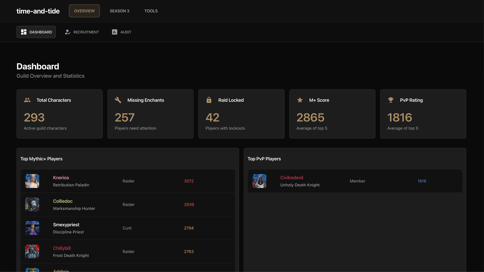
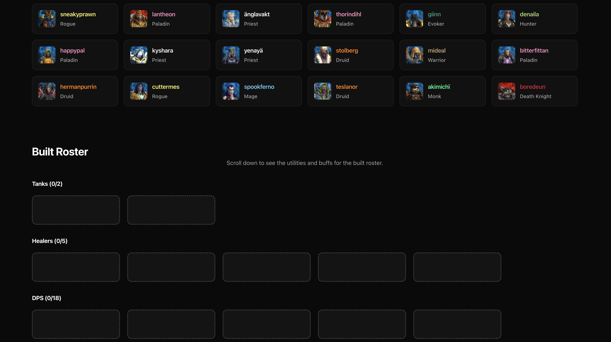
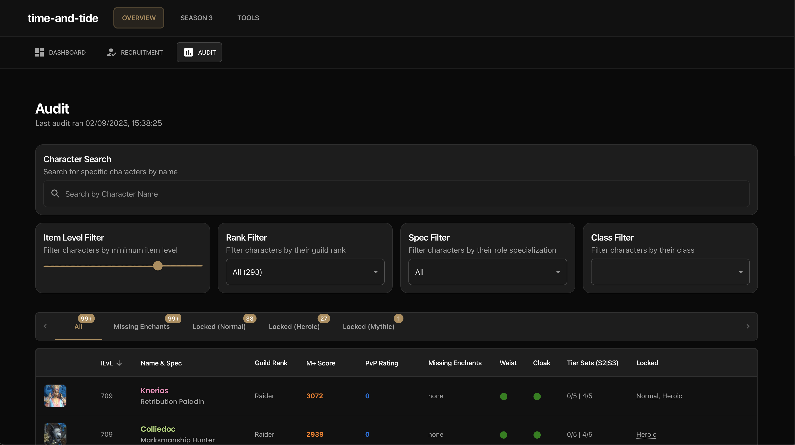
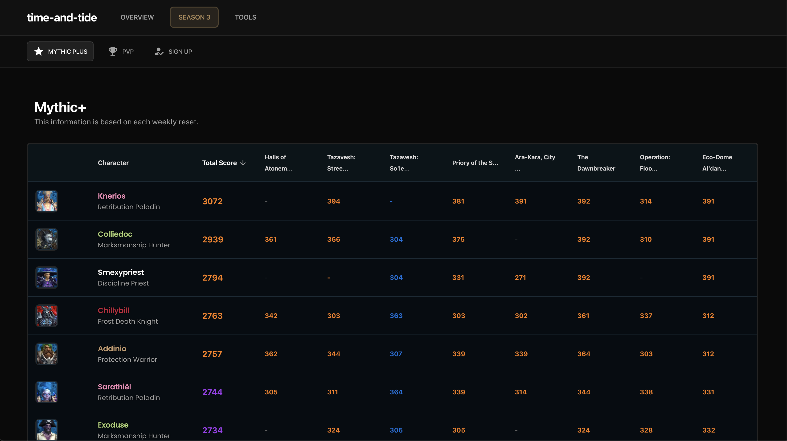

# World of Warcraft Guild Management Application

A modern, responsive web application for managing and displaying World of Warcraft guild information, raid progression, and player statistics. Built with Next.js 14, React 18, and Material-UI.

## 📄 License

This project is licensed under the **Creative Commons Attribution-NonCommercial-NoDerivatives 4.0 International License (CC BY-NC-ND 4.0)**.

**What this means:**
- ✅ You can share and redistribute the material in any medium or format
- ✅ You must give appropriate credit to the original author
- ❌ You may not use the material for commercial purposes
- ❌ You may not distribute modified versions of the material

For full license details, visit: https://creativecommons.org/licenses/by-nc-nd/4.0/

## 🖼️ Screenshots

### Dashboard



The Dashboard provides a comprehensive overview of your guild, including member statistics, top PvE and PvP performers, role distribution charts, missing enchants, and recent activity. It serves as the main landing page for quick insights into guild health and progression.

### Roster Builder



The Roster Builder is an interactive tool for planning raid compositions. Drag and drop characters into raid slots, filter by role or class, and optimize your team for upcoming encounters. This tool helps raid leaders organize and balance their groups efficiently.

### Audit



The Audit page offers detailed analysis of each guild member's character, including gear, missing enchants, item level, and raid lockout status. Use this section to identify areas for improvement and ensure your team is raid-ready.

### Mythic+ Overview



The Mythic+ Overview tracks your guild's dungeon progression, displaying player M+ scores, top performers, and seasonal achievements. Quickly identify key pushers and monitor overall Mythic+ activity.

### Season 3 Signup


The Season 3 Signup page allows members to register their interest and goals for the upcoming season. Collect information on returning players, preferred roles, and personal objectives to streamline roster planning.

### UI/Design Example


## 🏗️ Architecture Overview

This is a Next.js 14 frontend application that serves as a comprehensive guild management dashboard. It connects to a separate backend API to fetch guild data, player statistics, and raid progression information.

### Backend API

The backend API server for this application can be found at: [https://github.com/thedanzor/world-of-warcraft-api](https://github.com/thedanzor/world-of-warcraft-api)

The backend is an Express.js API server that:
- Fetches guild data from the Battle.net API
- Processes character information, gear, and statistics
- Provides real-time data updates via WebSocket
- Manages MongoDB data storage
- Handles authentication and rate limiting
- Supports both Retail and Classic WoW guilds

### Tech Stack
- **Framework**: Next.js 14 (App Router)
- **UI Library**: Material-UI (MUI) v5
- **Styling**: SCSS + Tailwind CSS
- **State Management**: React Hooks
- **Charts**: Recharts
- **Drag & Drop**: React DnD
- **Fonts**: Google Fonts (Poppins, Public Sans)

## 🔧 Environment Variables

Create a `.env.local` file in the root directory with the following variables:

```bash
# Backend API Configuration
NEXT_PUBLIC_BACKEND_URL=http://localhost:8000
NEXT_PUBLIC_CLIENT_BACKEND_URL=http://localhost:8000

# Guild Information
NEXT_PUBLIC_GUILD_NAME=Your Guild Name
NEXT_PUBLIC_GUILD_REALM=Your Realm Name

# Application URLs
NEXT_PUBLIC_BASE_URL=https://your-domain.com
NEXT_PUBLIC_APP_URL=https://your-domain.com
```

### Environment Variables Explained

| Variable | Description | Required |
|----------|-------------|----------|
| `NEXT_PUBLIC_BACKEND_URL` | URL of your backend API server | ✅ |
| `NEXT_PUBLIC_CLIENT_BACKEND_URL` | Client-side backend URL (fallback) | ✅ |
| `NEXT_PUBLIC_GUILD_NAME` | Your guild's name for display | ✅ |
| `NEXT_PUBLIC_GUILD_REALM` | Your guild's realm name | ✅ |
| `NEXT_PUBLIC_BASE_URL` | Your application's base URL for SEO | ✅ |
| `NEXT_PUBLIC_APP_URL` | Your application's URL for API calls | ✅ |

## ⚙️ Application Configuration

The application configuration is managed in `app.config.js`:

### Guild Settings
```javascript
{
  "GUILD_NAME": "Your Guild Name",
  "GUILD_REALM": "Your Realm",
  "REGION": "eu",
  "LEVEL_REQUIREMENT": 80,
  "ITEM_LEVEL_REQUIREMENT": 450,
  "MIN_CHECK_CAP": 450,
  "MAX_CHECK_CAP": 720,
  "MIN_TIER_ITEMLEVEL": 640
}
```

### Role Definitions
```javascript
{
  "TANKS": ["Blood", "Vengeance", "Guardian", "Brewmaster", "Protection"],
  "HEALERS": ["Preservation", "Mistweaver", "Holy", "Discipline", "Restoration"],
  "MAIN_RANKS": [0,1,2,3,4,5,6,7],
  "ALT_RANKS": [8,9,10]
}
```

### Guild Ranks
```javascript
{
  "GUILLD_RANKS": [
    "Guild Lead",
    "Officer", 
    "Officer Alt",
    "Raider",
    "Trial Raider",
    "Member",
    "Alt",
    "New Recruit"
  ]
}
```

## 🗂️ Routes & Features

### Main Pages

#### `/` - Dashboard
- **Purpose**: Main guild overview and statistics
- **Features**: 
  - Guild member overview
  - Top players (PvE/PvP)
  - Role distribution charts
  - Missing enchants statistics
  - Recent activity feed
- **Data**: Fetches comprehensive guild data with statistics

#### `/roster` - Roster Builder
- **Purpose**: Interactive raid roster planning
- **Features**:
  - Drag & drop character assignment
  - Role-based filtering
  - Raid composition optimization
  - Save/load roster configurations
- **Data**: Full guild member list with roles and specs

#### `/audit` - Guild Audit
- **Purpose**: Detailed guild member analysis
- **Features**:
  - Character gear analysis
  - Missing enchants tracking
  - Item level requirements
  - Raid lockout status
  - Performance metrics
- **Data**: Detailed character data with gear analysis

#### `/mythic-plus` - Mythic+ Overview
- **Purpose**: Mythic+ dungeon progression tracking
- **Features**:
  - Player M+ scores
  - Top performers
  - Key level tracking
  - Seasonal progression
- **Data**: M+ specific data filtered from guild roster

#### `/rated-pvp` - PvP Overview
- **Purpose**: Rated PvP player tracking
- **Features**:
  - Arena ratings
  - RBG ratings
  - Top PvP performers
  - Season progression
- **Data**: PvP specific data filtered from guild roster

#### `/season3` - Season 3 Planning
- **Purpose**: Season 3 preparation and signup
- **Features**:
  - Season 3 signup forms
  - Character planning tools
  - Goal setting
  - Returning player tracking
- **Data**: Season 3 specific data and signups

#### `/mrt` - MRT Integration
- **Purpose**: Method Raid Tools integration
- **Features**:
  - MRT note import/export
  - Raid composition tools
  - Character note management
- **Data**: MRT compatible data structures

#### `/join` - Recruitment
- **Purpose**: Guild recruitment information
- **Features**:
  - Guild information
  - Requirements
  - Application process
- **Data**: Static recruitment content

### API Routes

#### Data Endpoints
- `GET /api/data` - Raw guild data
- `GET /api/data/filtered` - Filtered and paginated guild data
- `GET /api/health` - Backend health check
- `GET /api/status` - Backend status information

#### Statistics Endpoints
- `GET /api/stats/missing-enchants` - Missing enchants statistics
- `GET /api/stats/top-pvp` - Top PvP players
- `GET /api/stats/top-pve` - Top PvE players
- `GET /api/stats/role-counts` - Role distribution counts

#### Season 3 Endpoints
- `GET /api/season3/data` - Season 3 data
- `POST /api/season3/signup` - Season 3 signup
- `GET /api/season3/test` - Season 3 endpoint testing

#### Utility Endpoints
- `GET /api/test-connection` - Backend connectivity testing
- `POST /api/update` - Trigger data updates

## 📊 Data Structure

### Character Data Structure
```javascript
{
  "name": "CharacterName",
  "realm": "RealmName",
  "level": 80,
  "itemLevel": 645,
  "class": "Warrior",
  "spec": "Arms",
  "rank": 0,
  "rankName": "Guild Lead",
  "isMain": true,
  "missingEnchants": ["WRIST", "LEGS"],
  "raidLockouts": {
    "instance1": "2024-01-15T10:00:00Z"
  },
  "mythicPlus": {
    "score": 2500,
    "bestKeys": [...]
  },
  "pvp": {
    "arenaRating": 1800,
    "rbgRating": 1600
  }
}
```

### Statistics Data Structure
```javascript
{
  "statistics": {
    "totalMembers": 150,
    "activeMembers": 120,
    "averageItemLevel": 645,
    "roleDistribution": {
      "tanks": 8,
      "healers": 12,
      "dps": 130
    }
  },
  "missingEnchants": {
    "all": 45,
    "mains": 12,
    "alts": 33
  },
  "topPvp": [...],
  "topPve": [...]
}
```

## 🚀 Getting Started

### Prerequisites
- Node.js 18+ 
- Yarn or npm
- Backend API server running

### Installation

1. **Clone the repository**
   ```bash
   git clone <repository-url>
   cd repo-name
   ```

2. **Install dependencies**
   ```bash
   yarn install
   # or
   npm install
   ```

3. **Set up environment variables**
   ```bash
   cp .env.example .env.local
   # Edit .env.local with your configuration
   ```

4. **Start the development server**
   ```bash
   yarn dev
   # or
   npm run dev
   ```

5. **Open your browser**
   Navigate to `http://localhost:3000`

### Production Build

1. **Build the application**
   ```bash
   yarn build
   # or
   npm run build
   ```

2. **Start the production server**
   ```bash
   yarn start
   # or
   npm start
   ```


## 🔧 Development

### Project Structure
```
repo-name/
├── app/                    # Next.js App Router pages
│   ├── api/               # API routes
│   ├── audit/             # Audit page
│   ├── mythic-plus/       # M+ page
│   ├── rated-pvp/         # PvP page
│   ├── roster/            # Roster page
│   ├── season3/           # Season 3 page
│   └── mrt/               # MRT page
├── core/                   # Core application code
│   ├── components/         # Reusable components
│   ├── hooks/             # Custom React hooks
│   ├── sections/          # Page sections
│   ├── modules/           # Feature modules
│   └── utils/             # Utility functions
├── lib/                    # Library code
│   ├── api.js             # API client
│   └── clientApi.js       # Client-side API
└── public/                 # Static assets
```

### Key Features

#### Real-time Data Updates
- 10-minute cache revalidation
- Server-side data fetching
- Optimistic UI updates

#### Responsive Design
- Mobile-first approach
- Material-UI components
- Custom SCSS styling

#### Performance Optimizations
- Next.js App Router
- Server-side rendering
- Image optimization
- Code splitting

#### Accessibility
- ARIA labels
- Keyboard navigation
- Screen reader support
- High contrast mode

## 🤝 Contributing

1. Fork the repository
2. Create a feature branch (`git checkout -b feature/amazing-feature`)
3. Commit your changes (`git commit -m 'Add amazing feature'`)
4. Push to the branch (`git push origin feature/amazing-feature`)
5. Open a Pull Request

## 📝 License

This project is licensed under the Creative Commons Attribution-NonCommercial-NoDerivatives 4.0 International License (CC BY-NC-ND 4.0).

## ⚠️ Warning

This project is currently being refactored to be brought to the open source community. There's still some messy code here that needs to be cleaned up. Please be aware that:

- Some components may have inconsistent coding patterns
- Documentation may be incomplete in certain areas
- Error handling may need improvement
- Code organization is still being optimized

I'm actively working on improving code quality and documentation.

## 📋 Open Todos

### High Priority
- **Rebuild the MRT tool** - The Method Raid Tools integration needs a complete overhaul
- **Rebuild the roster builder** - The drag-and-drop roster planning interface requires modernization

### Medium Priority
- Clean up inconsistent code patterns
- Improve error handling across all components
- Improve the UI / Design

### Low Priority
- Add more customization options for guild requirements
- Improve accessibility features

## 🆘 Support

For support, please contact me create an issue in the repository.

---

**Note**: This application requires a compatible backend API server to function properly. Ensure your backend is running and accessible before starting the frontend application.

